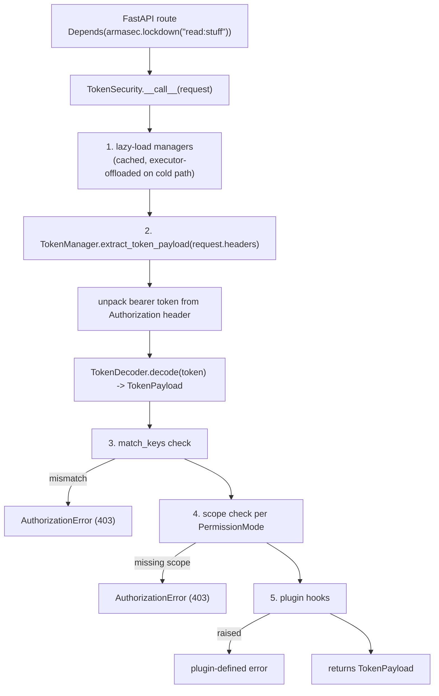

`armasec_lite` is one package, flat except for a small `pluggable/` subpackage:

| Module | Purpose |
| --- | --- |
| `__init__.py` | public exports |
| `armasec.py` | `Armasec` factory: `lockdown` / `lockdown_all` / `lockdown_some` |
| `token_security.py` | `TokenSecurity`, the FastAPI injectable |
| `token_manager.py` | header unpacking to `TokenPayload` |
| `token_decoder.py` | JWKs + token to verified `TokenPayload` |
| `token_payload.py` | `TokenPayload` |
| `openid_config_loader.py` | `OpenidConfigLoader` and the process-wide cache |
| `schemas.py` | `JWK`, `JWKs`, `OpenidConfig`, `DomainConfig`, `PermissionMode` |
| `exceptions.py` | `ArmasecError` family, `require_condition`, `handle_errors` |
| `utilities.py` | `noop`, `log_error`, `unwrap` |
| `jwt.py` | JWS/JWT encode and decode |
| `http.py` | `get_json` |
| `pluggable/__init__.py` | `PluginManager`, `hookimpl`, `plugin_manager` singleton |
| `pluggable/hookspecs.py` | `armasec_plugin_check` signature and docs |
| `pytest_extension.py` | pytest fixtures, shipped under the `[test]` extra |

## Request flow

Unchanged from upstream:

See [Request lifecycle](./request-lifecycle.md) for the status code produced by each
failure, [Caching](./caching.md) for what "cached" means at step 1, and
[Threading model](./threading-model.md) for why the cold path is the only one that touches
an executor.
