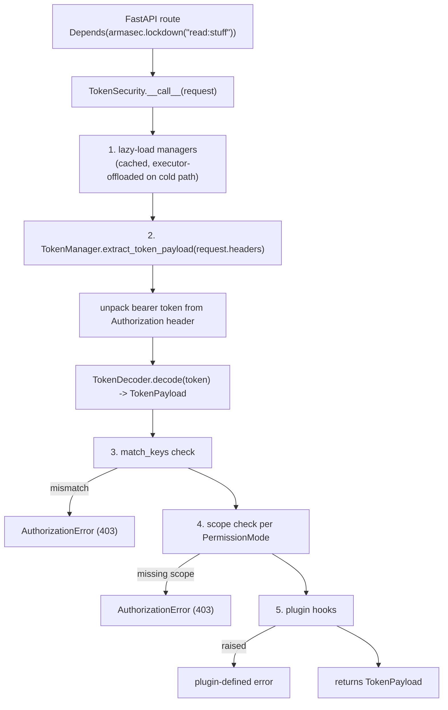

`armasec-lite` is a dependency-minimal reimplementation of
[armasec](https://github.com/omnivector-solutions/armasec) 3.0.3. It provides injectable
FastAPI authentication against OIDC providers with the same public API, built almost
entirely on the Python standard library.

Upstream carries ten runtime dependencies. Two of them (`pytest`, `respx`) are test tools
forced into every production install. Four more (`snick`, `py-buzz`, `auto-name-enum`,
`pluggy`) provide small conveniences that the standard library covers directly.
`armasec-lite` ships two runtime dependencies.

## Dependency reduction

| Upstream dependency | Replacement |
| --- | --- |
| `python-jose[cryptography]` | `jwt.py` (stdlib parsing, `cryptography` primitives) |
| `httpx` | `urllib.request` |
| `pydantic` | `dataclasses` (`armasec_lite.schemas`) |
| `py-buzz` | `exceptions.py` (~50 LOC) |
| `snick` | `textwrap` |
| `auto-name-enum` | `enum.Enum` |
| `pluggy` | `importlib.metadata` entry points (~55 LOC) |
| `respx` | monkeypatch of the internal HTTP layer |
| `pytest` (runtime) | moved to a `[test]` extra |
| `typer` | dropped with the CLI |
| `fastapi` | kept |
| (new) | `cryptography` |

## Three differences from upstream

`armasec-lite` targets a drop-in migration, but three things behave differently. Each is
covered in full on the [migration guide](./migration.md).

1. **Import name.** The package imports as `armasec_lite`, not `armasec`. The distribution
   name changes too: `armasec-lite`, not `armasec`.
2. **`verify_issuer` defaults to `True`.** Upstream loads a provider's `issuer` from its
   discovery document and never checks it against the token's `iss`. `armasec-lite` checks
   it by default; the escape hatch is `DomainConfig(verify_issuer=False)`.
3. **The OIDC loader cache is process-wide.** It is shared across every `Armasec` instance
   in the process, keyed by `(domain, use_https)`, rather than being private to each
   instance. Tests that construct more than one `Armasec` against the same domain need to
   call `armasec_lite.openid_config_loader.clear_cache()` between them, or use the shipped
   `mock_openid_server` pytest fixture, which does this automatically.

## Request flow

Request handling is unchanged from upstream in shape:

See [Architecture](./architecture/index.md) for the module map behind each step, and
[Security](./security/index.md) for what the library defends against along the way.
